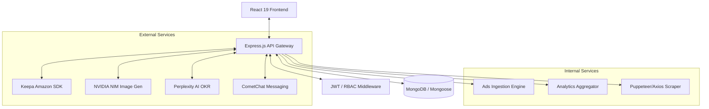
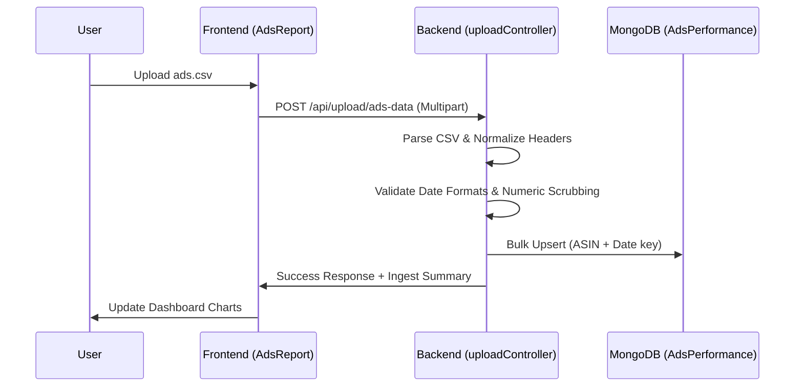
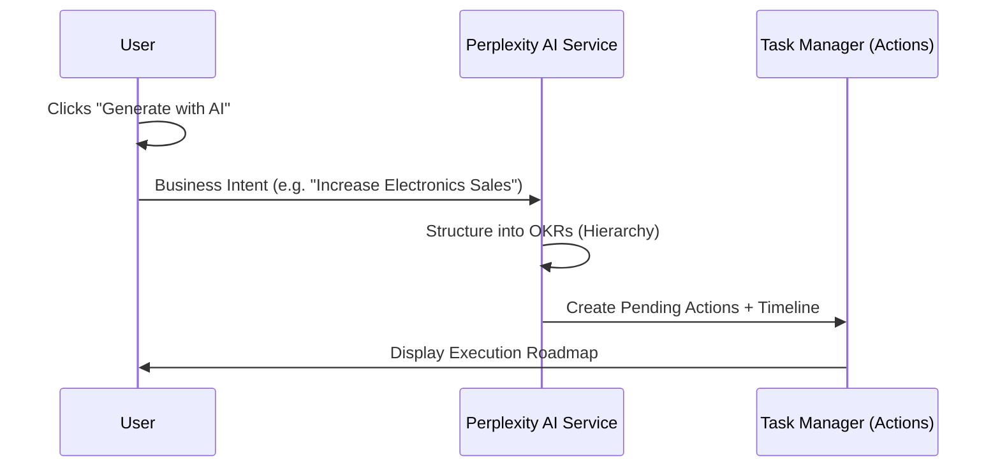

# GMS Report: Enterprise E-commerce Intelligence Platform

[](https://mongodb.com)
[](https://tailwindcss.com)
[](https://www.nvidia.com/en-us/ai-data-science/generative-ai/)

A state-of-the-art Business Intelligence (BI) and Inventory Management system designed explicitly for high-volume Amazon India sellers. The platform combines real-time advertising analytics, automated ASIN discovery, and AI-driven goal generation into a unified, high-performance dashboard.

---

## 🏗️ System Architecture

The GMS Report platform is built on a modern MERN stack with a service-oriented backend and a component-driven frontend using the **Zinc Design System**.



---

## 🚀 Key Modules & Features

### 1. Ads Intelligence & Ingestion
*   **Case-Insensitive Mapping**: Robust CSV ingestion supporting 34+ performance headers.
*   **Real-time Attribution**: Immediate calculation of ROAS, ACoS, and Spend Velocity.
*   **Granular Filtering**: Unified Month/Year and Custom Range selectors across all analytical views.

### 2. SKU & Parent ASIN Analytics
*   **Direct Aggregation**: Real-time MongoDB aggregation pipelines mapping `AdsPerformance` to `Master` unit data.
*   **Marketplace Lock**: Standardized for `amazon.in` with INR (₹) currency formatting.

### 3. AI Automation (Goal & Image Gen)
*   **OKR Generation**: Integrated Perplexity AI to transform business intent into structured weekly execution plans.
*   **NVIDIA SD3 Integration**: Automated lifestyle image generation for product listings with low image counts.

### 4. Inventory & P&L Control
*   **Profit Reconciliation**: Automated SKU-level profit calculation including FBA fees and referral commissions.
*   **Health Monitoring**: Real-time BSR and LQS tracking via Keepa SDK.

---

## 🛠️ Core Workflows

### Data Ingestion Flow (Ads Performance)


### AI Execution Flow (OKRs & Tasks)


---

## ⚙️ Installation & Setup

### Prerequisites
*   **Node.js**: v18.0.0+
*   **MongoDB**: v6.0+ (Atlas or Local)
*   **Package Manager**: npm or yarn

### 1. Clone & Install
```bash
git clone https://github.com/your-repo/gms-report.git
cd gms-report

# Install Backend Dependencies
cd backend
npm install

# Install Frontend Dependencies
cd ../gms-dashboard
npm install
```

### 2. Environment Configuration
Create a `.env` file in the `backend/` directory:

```env
# Server
PORT=3001
NODE_ENV=development

# Database
MONGO_URI=mongodb+srv://... (or localhost)

# Authentication
JWT_SECRET=your_jwt_secret
JWT_REFRESH_SECRET=your_refresh_secret

# AI Keys
PERPLEXITY_API_KEY=pplx-...
NVIDIA_NIM_API_KEY=nvapi-...

# E-commerce SDK
KEEPA_API_KEY=your_keepa_key
```

### 3. Running Locally
**Start Backend:**
```bash
cd backend
npm run dev
```

**Start Frontend:**
```bash
cd gms-dashboard
npm run dev
```

---

## 🎨 Design System: Pristine White
The platform utilizes a customized **Zinc-based design system** optimized for enterprise clarity.

*   **Primary Palette**: Zinc-900 (Black) / Zinc-500 (Gray) / White.
*   **Typography**: Inter / Outfit for modern readability.
*   **Components**: Glassmorphism effects, subtle borders, and high-contrast labels.

---

## 📖 Operational Guides (Step-by-Step)

### 📊 Ads Data Ingestion Workflow
1.  **Prepare CSV**: Export your advertising report from Amazon Seller Central (Daily breakdown).
2.  **Upload**: Navigate to **Ads Intelligence** and click the `IMPORT ADS` button.
3.  **Validation**: The system automatically attempts case-insensitive mapping for headers like `Ad Sales`, `Ad Spend`, `Clicks`, and `Impressions`.
4.  **Processing**: The backend (`uploadController.js`) performs a `bulkWrite` operation, upserting records based on the unique combination of `ASIN` + `Date`.
5.  **Attribution**: Once ingested, the **Dashboard** and **SKU Reports** will automatically calculate:
    *   **ROAS**: `Ad Sales / Ad Spend`
    *   **ACoS**: `(Ad Spend / Ad Sales) * 100`

### 🔍 SKU Performance Deep-Dive
1.  **Filter Selection**: Choose a **Month** or **Custom Range** from the global filter.
2.  **Aggregation**: The `dataController.js` executes a MongoDB aggregation pipeline:
    *   Matches `Master` unit data for the selected ASINs.
    *   Lookups `AdsPerformance` data for the exact date range.
    *   Sums `spend` and `sales` to provide a unified P&L view.
3.  **Visualization**: The **SKU Intelligence** page displays the result in a high-performance `DataTable` with real-time metric calculation.

### 🖼️ AI Image Generation (NVIDIA NIM)
1.  **Trigger**: Identify ASINs in the **ASIN Manager** with low image counts (< 7).
2.  **Generation**: Click "Generate Images". The system sends the product title and attributes to the NVIDIA SD3 API.
3.  **Storage**: Images are saved in `/uploads/asin_images/[ASIN]/`.
4.  **Management**: Browse the generated assets in the **File Manager** under the dedicated ASIN folder.

### 🎯 Goal Tracking & Achievement
1.  **Define Intent**: Enter a natural language goal in the **Action Manager** (e.g., "Improve my ACoS by 5%").
2.  **AI Decomposition**: Perplexity AI splits the goal into actionable weekly tasks.
3.  **Execution**: Assign tasks to team members. The system tracks "Time to Complete" vs. "Planned Duration".
4.  **Reporting**: View the **Goal vs Achievement** report to analyze team efficiency and task variance.

---

## ️ Scripts & Utilities
Built-in hierarchy for multi-user operations:
1.  **Admin**: Full platform access + User Management.
2.  **Brand Manager**: Seller-specific isolation + Campaign control.
3.  **Assignee**: Task-level access for execution tracking.

---

## 📄 License
© 2026 Easysell Projects. Confidential and Proprietary.
