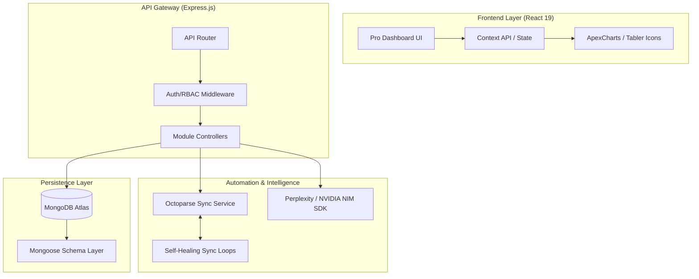

# GMS Dashboard Pro — Technical Manual & Architecture Guide

[](https://github.com/your-repo)
[](https://mongodb.com)
[](https://apexcharts.com)

GMS Dashboard Pro is an enterprise-grade **E-commerce Intelligence Platform** tailored for high-volume Amazon India operations. This document provides an exhaustive technical deep-dive into the platform's architecture, data models, automated pipelines, and intelligence layers.

---

## 🏛️ System Architecture

The platform is designed around a **Service-Oriented MERN Stack**, prioritizing data integrity, high-speed aggregations, and automated marketplace synchronization.

### High-Level Ecosystem


---

## 💻 Technology Stack

### Frontend
- **Framework:** React 19 (via Vite)
- **Design System:** Custom Zinc UI (Glassmorphic)
- **Visualizations:** ApexCharts (Triple-stack for BSR, Price, Rating)
- **Icons:** Lucide React
- **State Management:** Context API & Zustand
- **Real-Time:** Socket.io-client, CometChat React UI Kit

### Backend
- **Runtime & Framework:** Node.js, Express.js
- **Database:** MongoDB Atlas (Mongoose ODM)
- **Authentication:** Clerk SDK + Custom JWT Auth
- **File Processing:** Multer, xlsx
- **Scheduling:** node-cron

### Integrations
- **Web Scraping:** Octoparse OpenAPI v1.0
- **AI Analytics:** Perplexity API
- **Asset Generation:** NVIDIA NIM (SD3 Medium)
- **Communications:** CometChat

---

## 📂 Project Structure

```text
gms-dashboard/
├── backend/                # Node.js / Express Server
│   ├── config/             # DB & App Configuration
│   ├── controllers/        # Business Logic (30+ Controllers)
│   ├── cron/               # Scheduled Task Orchestration
│   ├── middleware/         # Auth, Upload, RBAC Logic
│   ├── models/             # Mongoose Schemas (33 Models)
│   ├── routes/             # REST API Definition
│   ├── services/           # External API Wrappers (Octoparse, NIM)
│   ├── uploads/            # Local Asset Storage (ASIN Images)
│   └── utils/              # Calculation & Validation Helpers
├── src/                    # React 19 Frontend
│   ├── components/         # Premium UI Component Library
│   ├── contexts/           # Global State Management
│   ├── hooks/              # Reusable Logic (API, UI)
│   ├── pages/              # Module-Specific Views
│   ├── styles/             # Zinc Design System Utilities
│   └── utils/              # Frontend formatting & UI logic
├── public/                 # Static Assets
└── package.json            # Core Dependencies
```

---

## 🗄️ Database Strategy & Core Schemas

The system utilizes **MongoDB Atlas** with heavy optimization for time-series data (Ads) and relational-like tracking (ASINs).

### 1. `Asin` Model (The Platform Anchor)
Tracks 110+ data points including:
- **Identity:** ASIN, SKU, Seller ID, Brand, Category.
- **Market State:** `currentPrice`, `bsr`, `rating`, `reviewCount`, `soldBy`.
- **Historical Arrays:** `history` (Daily snapshot) and `weekHistory` (WoW metrics).
- **Intelligent Wrappers:** `lqsDetails` (Listing Quality Score) and `feePreview` (FBA Profitability).

### 2. `AdsPerformance` Model (Attribution Engine)
Optimized for daily/monthly performance tracking:
- **Core KPIs:** Spend, Sales, Impressions, Clicks, Orders.
- **Attribution Logic:** Automated calculation of ROAS, ACoS, CTR, and AOV.

### 3. Strategy Models (`Action`, `Goal`, `Objective`)
Supports the AI-driven strategy layer:
- **Goal:** High-level business intent (e.g., "Improve Margin").
- **Objective / KeyResult (OKR):** Measurable targets.
- **Action:** Executable tasks with statuses and deadlines.

---

## 🚀 Advanced Module Capabilities

### 🛡️ ASIN Manager Pro
The central interface provides a "Mission Control" experience:
- **Horizontal Product Intelligence:** Top-bar summary housing vital stats + live Buy Box monitoring.
- **ApexCharts Triple-Stack:** Price History, BSR Trend (Reversed Y-Axis), and Rating Progression.
- **Smart Filtering:** Range selectors slicing historical arrays in real-time.

### 🤖 Octoparse Sync Service (Data Ingestion)
Seamless integration with **Octoparse OpenAPI v1.0** automates marketplace data lifecycles:
- **Daily Extraction:** Cron jobs trigger cloud scrapes nightly.
- **Advanced Mapping:** Regex and DOM parsing structure raw HTML (e.g., counting image nodes to verify LQS thresholds).
- **Self-Healing Loops:** If anomalies exist, the system automatically queues targeted scrapes.
- **Bug Fix Highlight:** Features memory-safe, case-insensitive ASIN matching with parameterized SQL protection to ensure reliable data aggregation.

---

## 🧠 Intelligence & AI Layer

### 🎯 OKR Engine (Perplexity AI)
- Uses advanced LLMs to decompose vague business goals into 4-week execution plans.
- Validates tasks against marketplace KPIs (ACoS, ROAS).

### 🖼️ Image Optimization (NVIDIA NIM)
- Triggered when listings fail LQS image count thresholds (< 7).
- Automatically invokes the SD3 workflow to generate high-quality lifestyle images for the product.

---

## 🛠️ API Reference (Highlights)

- `GET /api/asins`: Unified, paginated list with seller filtering.
- `POST /api/asins/sync`: Manual trigger for Octoparse orchestration.
- `POST /api/upload/ads-data`: Complex CSV parsing with **case-insensitive header mapping**.

---

## 🔧 DevOps, Config, & Setup

### Environment Variables (Backend)
Required secrets in `.env`:
```env
PORT=3001
MONGODB_URI=mongodb+srv://...
JWT_SECRET=your-secret
CLERK_SECRET_KEY=sk_live_...
OCTOPARSE_API_KEY=...
NIM_API_KEY=...
PERPLEXITY_API_KEY=...
```

### Development
```bash
# Start Backend
cd backend
npm run dev

# Start Frontend
cd src
npm run dev
```

### Performance Optimization
- **MongoDB Indexing:** Compound indexes on `asinCode + seller` ensure sub-100ms queries.
- **Vercel Edge Rendering:** Optimized zero-latency loading for massive React DataTables.

---

## 🎨 Design System: Zinc Pro
Focuses on clarity and data density:
- **Typography:** Inter (UI) / Outfit (Headers).
- **Styling:** Tailwind-based with glassmorphism (12px backdrop blur).
- **Iconography:** Lucide React icons standardized across the platform.

---

## 📄 License
© 2026 Easysell Projects. Distributed under the ISC License. 
Confidential and Proprietary. All Rights Reserved.